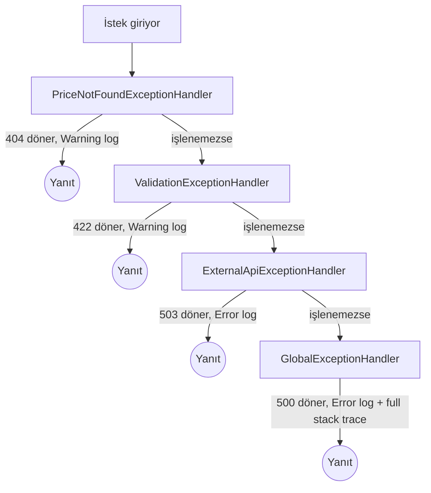

# Saydın — Observability Mimarisi

## Genel Yaklaşım

Üç observability sütunu ("three pillars") birlikte uygulanır:

| Sütun | Araç | Nerede Görülür |
|-------|------|----------------|
| **Structured Logging** | Serilog + OTLP sink | Aspire Dashboard → Logs |
| **Distributed Tracing** | OpenTelemetry | Aspire Dashboard → Traces |
| **Metrics** | OpenTelemetry + Prometheus | Aspire Dashboard → Metrics / Prometheus UI |

Tüm sinyaller **OTLP (OpenTelemetry Protocol)** üzerinden `localhost:4317`'ye (Aspire Dashboard container) gönderilir.

---

## Geliştirme Ortamı Araçları

| Araç | URL | Amaç |
|------|-----|-------|
| **Aspire Dashboard** | http://localhost:18888 | Log, trace ve metrik tek arayüzde |
| **Prometheus** | http://localhost:9090 | Metrik sorgulama (PromQL) |
| **pgAdmin** | http://localhost:5050 | PostgreSQL yönetimi |
| **Redis Insight** | http://localhost:5540 | Redis izleme ve yönetimi |

---

## Logging

### Yaklaşım: Serilog + OTLP

Serilog kullanılır çünkü:
- `.ForContext<T>()` ile zengin log enrichment
- `{@object}` ile structured (JSON) nesne loglama
- OTLP sink aracılığıyla Aspire Dashboard'a gönderim
- Trace ID ve Span ID otomatik olarak log'a eklenir (trace-log korelasyonu)

### NuGet Paketleri

```xml
<PackageReference Include="Serilog.AspNetCore" Version="9.*" />
<PackageReference Include="Serilog.Sinks.Console" Version="6.*" />
<PackageReference Include="Serilog.Sinks.OpenTelemetry" Version="4.*" />
<PackageReference Include="Serilog.Enrichers.Environment" Version="3.*" />
<PackageReference Include="Serilog.Enrichers.Thread" Version="4.*" />
```

### Konfigürasyon

```csharp
// Program.cs
Log.Logger = new LoggerConfiguration()
    .Enrich.FromLogContext()
    .Enrich.WithMachineName()
    .Enrich.WithThreadId()
    .WriteTo.Console(new JsonFormatter())           // Yapısal JSON
    .WriteTo.OpenTelemetry(opts =>                  // OTLP → Aspire Dashboard
    {
        opts.Endpoint = "http://localhost:4317";
        opts.Protocol = OtlpProtocol.Grpc;
        opts.ResourceAttributes = new Dictionary<string, object>
        {
            ["service.name"] = "saydin-api",
            ["service.version"] = "1.0.0",
        };
    })
    .MinimumLevel.Information()
    .MinimumLevel.Override("Microsoft.AspNetCore", LogEventLevel.Warning)
    .MinimumLevel.Override("System.Net.Http", LogEventLevel.Warning)
    .CreateLogger();

builder.Host.UseSerilog();
```

### Log Seviyeleri

| Seviye | Ne Zaman |
|--------|----------|
| `Error` | Beklenmeyen exception, dış API başarısız |
| `Warning` | Beklenen ama anormal durum (fiyat bulunamadı, rate limit) |
| `Information` | İş akışı adımları (veri çekildi, hesaplama yapıldı) |
| `Debug` | Geliştirme detayları (sadece Development ortamında) |

### Log Kuralları

```csharp
// DOĞRU ✓ — structured logging, parametreli mesaj
_logger.LogInformation("Fiyat hesaplandı: {Symbol} {BuyDate} → {ProfitLossPercent}%",
    symbol, buyDate, profitLossPercent);

// YANLIŞ ✗ — string interpolation ile log (structured değil)
_logger.LogInformation($"Fiyat hesaplandı: {symbol} {buyDate} → {profitLossPercent}%");
```

---

## Distributed Tracing

### NuGet Paketleri

```xml
<PackageReference Include="OpenTelemetry.Extensions.Hosting" Version="1.10.*" />
<PackageReference Include="OpenTelemetry.Instrumentation.AspNetCore" Version="1.10.*" />
<PackageReference Include="OpenTelemetry.Instrumentation.Http" Version="1.10.*" />
<PackageReference Include="OpenTelemetry.Instrumentation.Runtime" Version="1.10.*" />
<PackageReference Include="OpenTelemetry.Exporter.OpenTelemetryProtocol" Version="1.10.*" />
```

### Konfigürasyon

```csharp
builder.Services.AddOpenTelemetry()
    .ConfigureResource(resource => resource
        .AddService("saydin-api", serviceVersion: "1.0.0")
        .AddAttributes(new Dictionary<string, object>
        {
            ["deployment.environment"] = builder.Environment.EnvironmentName.ToLower()
        }))
    .WithTracing(tracing => tracing
        .AddAspNetCoreInstrumentation(opts =>
        {
            opts.RecordException = true;
            // Health check trace'lerini hariç tut
            opts.Filter = ctx => !ctx.Request.Path.StartsWithSegments("/health");
        })
        .AddHttpClientInstrumentation(opts => opts.RecordException = true)
        .AddOtlpExporter(opts =>
        {
            opts.Endpoint = new Uri("http://localhost:4317");
            opts.Protocol = OtlpExportProtocol.Grpc;
        }));
```

### Custom Span'lar

İş akışı adımları için manuel span ekle:

```csharp
// ActivitySource: Saydin.Shared'de merkezi olarak tanımlanır
public static class SaydinActivitySource
{
    public static readonly ActivitySource Instance = new("Saydin", "1.0.0");
}

// Kullanım
using var activity = SaydinActivitySource.Instance.StartActivity("WhatIfCalculation");
activity?.SetTag("asset.symbol", request.AssetSymbol);
activity?.SetTag("buy.date", request.BuyDate.ToString());
// ... hesaplama
activity?.SetTag("profit.percent", result.ProfitLossPercent);
```

---

## Metrics

### NuGet Paketleri

```xml
<PackageReference Include="OpenTelemetry.Instrumentation.AspNetCore" Version="1.10.*" />
<PackageReference Include="OpenTelemetry.Exporter.Prometheus.AspNetCore" Version="1.10.*-beta.*" />
```

### Konfigürasyon

```csharp
builder.Services.AddOpenTelemetry()
    .WithMetrics(metrics => metrics
        .AddAspNetCoreInstrumentation()  // HTTP request metrikleri
        .AddHttpClientInstrumentation()  // Outbound HTTP metrikleri
        .AddRuntimeInstrumentation()     // GC, thread pool vb.
        .AddOtlpExporter(opts =>
        {
            opts.Endpoint = new Uri("http://localhost:4317");
            opts.Protocol = OtlpExportProtocol.Grpc;
        })
        .AddPrometheusExporter());       // /metrics endpoint'i

// Route kaydı
app.MapPrometheusScrapingEndpoint();  // GET /metrics
```

### Custom Metrikler

```csharp
// Saydin.Api — iş metrikleri
public static class SaydinMetrics
{
    private static readonly Meter Meter = new("Saydin.Api", "1.0.0");

    public static readonly Counter<long> WhatIfCalculations =
        Meter.CreateCounter<long>(
            "saydin.whatif.calculations.total",
            description: "Toplam hesaplama sayısı");

    public static readonly Histogram<double> CalculationDuration =
        Meter.CreateHistogram<double>(
            "saydin.whatif.calculation.duration.ms",
            unit: "ms",
            description: "Hesaplama süresi");
}

// Kullanım
SaydinMetrics.WhatIfCalculations.Add(1,
    new KeyValuePair<string, object?>("asset.symbol", symbol),
    new KeyValuePair<string, object?>("user.tier", userTier));
```

---

## Exception Handling

### Yaklaşım: IExceptionHandler Zinciri

.NET 10'un `IExceptionHandler` interface'i ile her exception türü için ayrı handler zinciri kurulur:



### Implementasyon Deseni

```csharp
// Saydin.Api/Exceptions/PriceNotFoundExceptionHandler.cs
public sealed class PriceNotFoundExceptionHandler(ILogger<PriceNotFoundExceptionHandler> logger)
    : IExceptionHandler
{
    public async ValueTask<bool> TryHandleAsync(
        HttpContext context,
        Exception exception,
        CancellationToken ct)
    {
        if (exception is not PriceNotFoundException ex)
            return false;

        logger.LogWarning(ex,
            "Fiyat bulunamadı: {Symbol} / {Date}",
            ex.AssetSymbol, ex.Date);

        context.Response.StatusCode = StatusCodes.Status404NotFound;
        await context.Response.WriteAsJsonAsync(new ProblemDetails
        {
            Type = "https://saydin.app/errors/price-not-found",
            Title = "Fiyat bulunamadı",
            Status = StatusCodes.Status404NotFound,
            Detail = ex.Message,
            Extensions = { ["nearestDates"] = ex.NearestAvailableDates }
        }, ct);

        return true;
    }
}

// Saydin.Api/Exceptions/GlobalExceptionHandler.cs
public sealed class GlobalExceptionHandler(ILogger<GlobalExceptionHandler> logger)
    : IExceptionHandler
{
    public async ValueTask<bool> TryHandleAsync(
        HttpContext context,
        Exception exception,
        CancellationToken ct)
    {
        // Aktif trace bilgisi log'a eklenir
        logger.LogError(exception,
            "İşlenmemiş exception: {ExceptionType} — TraceId: {TraceId}",
            exception.GetType().Name,
            Activity.Current?.TraceId.ToString() ?? context.TraceIdentifier);

        context.Response.StatusCode = StatusCodes.Status500InternalServerError;
        await context.Response.WriteAsJsonAsync(new ProblemDetails
        {
            Type = "https://saydin.app/errors/internal-error",
            Title = "Sunucu hatası",
            Status = StatusCodes.Status500InternalServerError,
            Detail = "Beklenmeyen bir hata oluştu. Lütfen tekrar deneyin.",
            Extensions = { ["traceId"] = Activity.Current?.TraceId.ToString() }
        }, ct);

        return true;
    }
}

// Program.cs — kayıt sırası önemli
builder.Services.AddProblemDetails();
builder.Services.AddExceptionHandler<PriceNotFoundExceptionHandler>();
builder.Services.AddExceptionHandler<ValidationExceptionHandler>();
builder.Services.AddExceptionHandler<ExternalApiExceptionHandler>();
builder.Services.AddExceptionHandler<GlobalExceptionHandler>();

app.UseExceptionHandler();
```

### TraceId İstemciye Döner

Her 5xx yanıtında `traceId` alanı dönülür. İstemci bu ID'yi loglara verebilir, geliştirici Aspire Dashboard'da tam trace'i bulabilir.

---

## Health Checks

### NuGet Paketleri

```xml
<PackageReference Include="AspNetCore.HealthChecks.NpgSql" Version="9.*" />
<PackageReference Include="AspNetCore.HealthChecks.Redis" Version="9.*" />
```

### Konfigürasyon

```csharp
builder.Services
    .AddHealthChecks()
    .AddNpgSql(
        connectionString: config.GetConnectionString("Postgres")!,
        name: "postgresql",
        tags: ["db", "sql"])
    .AddRedis(
        redisConnectionString: config.GetConnectionString("Redis")!,
        name: "redis",
        tags: ["cache"]);

// Health check endpoint → sade JSON
app.MapHealthChecks("/health", new HealthCheckOptions
{
    ResponseWriter = UIResponseWriter.WriteHealthCheckUIResponse
});

// Prometheus trace'lerini health check'e filtrele (gürültü olmasın)
app.MapHealthChecks("/health/live");   // Liveness: uygulama ayakta mı?
app.MapHealthChecks("/health/ready"); // Readiness: trafiğe hazır mı?
```

---

## Pratik Kullanım Senaryoları

### Senaryo 1: Yavaş Hesaplama Tespiti
1. Prometheus'ta `saydin.whatif.calculation.duration.ms` histogram'ını izle
2. P99 > 500ms uyarı: Hangi asset sembolü?
3. Aspire Dashboard'da ilgili trace'i bul → hangi adım yavaş?

### Senaryo 2: Dış API Hata Takibi
1. `ExternalApiException` logları Aspire Dashboard → Logs'ta görünür
2. Her log'da trace ID var → ilgili HTTP span'ını bul
3. Prometheus'ta `http.client.request.duration` metriği ile trend analizi

### Senaryo 3: Üretim Hata Analizi
1. Kullanıcı hata bildiriyor, `traceId: abc123` paylaşıyor
2. Aspire Dashboard → Traces → `abc123` ara
3. Tam çağrı zinciri: endpoint → service → repository → DB query
