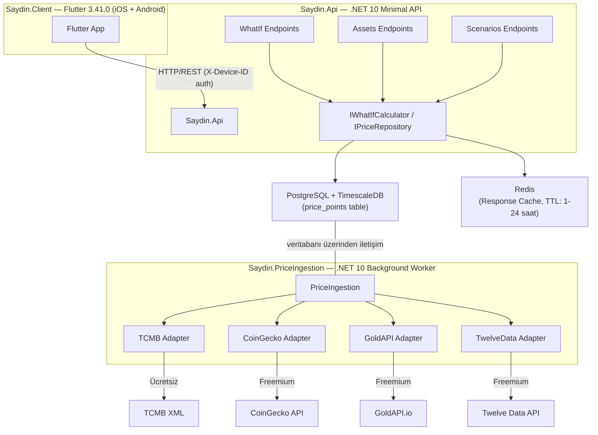

# Saydın - Mimari Genel Bakış

## Uygulama Nedir?

Saydın, Türk kullanıcılara yönelik bir finansal "ya alsaydım?" (what if) mobil uygulamasıdır. Kullanıcılar altın, gümüş, dolar, euro, BIST hisseleri veya kripto paralar için tarihi "ne olurdu?" hesaplamaları yapabilir.

**Örnek sorular:**
- "2020 başında 10.000 TL ile dolar alsaydım bugün ne kadar ederdi?"
- "01.03.2020'de Bitcoin alıp 01.01.2021'de satsaydım kar mı zarar mı ederdim?"

---

## Yüksek Seviye Mimari

---

## Servisler

### Saydin.Api
- .NET 10 Minimal API, port 5080
- HTTP endpoint'leri Flutter uygulamasına sunar
- Hiçbir dış finansal API'ye doğrudan bağlanmaz
- Redis üzerinden response caching uygular (WhatIfCalculator: 1 saat TTL)
- Scalar API dokümantasyonu: `GET /scalar/v1` (yalnızca Development modunda)
- Auth: MVP'de `X-Device-ID` header, Phase 2'de JWT

### Saydin.PriceIngestion
- .NET 10 Worker Service (`IHostedService`)
- HTTP endpoint expose etmez
- Zamanlanmış görevlerle dış API'lerden günlük fiyat verisi çeker
- PostgreSQL'e idempotent UPSERT ile yazar
- Polly ile retry/circuit-breaker yönetimi
- 4 adapter: TCMB (ücretsiz), CoinGecko, GoldAPI, TwelveData (API key gerekir, yoksa graceful skip)
- Backfill: 2010-01-01'den başlar; TCMB 90 günlük, CoinGecko/TwelveData 365 günlük chunk'larla çalışır
- `BaseAssetWorker` ile paylaşımlı chunk tabanlı backfill + günlük zamanlama

### Saydin.Shared
- Her iki servisin referans aldığı ortak sınıf kütüphanesi
- EF Core `SaydinDbContext` ve entity konfigürasyonları (`Asset`, `PricePoint`, `AssetType`)
- Exception'lar: `PriceNotFoundException`, `ExternalApiException`
- Diagnostics: `SaydinActivitySource`, `SaydinMetrics`

### Saydin.Client
- Flutter 3.41.0, iOS ve Android
- Feature-first Clean Architecture (domain / data / presentation katmanları)
- BLoC state management, `equatable` ile immutable state'ler
- **DI:** `get_it` ile lazy singleton servis locator; BLoC `registerFactory` ile (bellek dostu)
- **Ağ katmanı:** Dio + `DeviceIdInterceptor` (her isteğe `X-Device-ID` header ekler) + `RetryInterceptor` (GET/HEAD için üstel geri çekilmeli 2 yenileme)
- **Hata yönetimi:** `AppError` sealed class → `DioErrorMapper` dönüşümü → `ErrorReporter` (Sentry) raporlaması; yalnızca `ServerError` ve `UnknownError` Sentry'ye gönderilir
- **Lokalizasyon:** `flutter gen-l10n` + ARB dosyaları; tüm kullanıcı metinleri `app_tr.arb`'de, hardcoded string yasak
- **Hata mesajları widget katmanında çözülür** — BLoC yalnızca `AppError` tipi taşır, UI metni bilmez
- **CI/CD:** GitHub Actions — format, analyze, test (coverage), Android APK build, iOS no-codesign build

---

## Desteklenen Asset'ler

| Sembol | Görünen Ad | Kategori | Kaynak |
|--------|------------|----------|--------|
| `USDTRY` | Dolar/TL | currency | TCMB |
| `EURTRY` | Euro/TL | currency | TCMB |
| `XAU_TRY_GRAM` | Altın (Gram/TL) | precious_metal | GoldAPI |
| `XAG_TRY_GRAM` | Gümüş (Gram/TL) | precious_metal | GoldAPI |
| `BTC` | Bitcoin | crypto | CoinGecko |
| `ETH` | Ethereum | crypto | CoinGecko |
| `THYAO` | Türk Hava Yolları | stock | Twelve Data |
| `GARAN` | Garanti Bankası | stock | Twelve Data |
| ... | ... | ... | ... |

---

## Teknoloji Yığını

| Katman | Teknoloji | Versiyon |
|--------|-----------|----------|
| Mobil | Flutter | 3.41.0 |
| Backend | .NET Minimal API | 10 |
| ORM | Entity Framework Core (Npgsql) | latest |
| Veritabanı | PostgreSQL + TimescaleDB | latest |
| Cache | Redis | latest |
| Geliştirme Ortamı | Docker Compose | latest |
| CI/CD | GitHub Actions | — |

### MVP'de Kullanılmayanlar

| Teknoloji | Neden Yok |
|-----------|-----------|
| Kafka | 1 producer + 1 consumer → PostgreSQL yeterli |
| Dapr | 2 servis birbirleriyle konuşmuyor |
| Kubernetes | Hetzner VPS yeterli, ölçek gerektikçe eklenecek |

Detaylı gerekçe için: [ADR-001](../decisions/ADR-001-no-kafka-mvp.md), [ADR-005](../decisions/ADR-005-backend-monorepo.md)

---

## Servisler Arası İletişim

MVP'de servisler **yalnızca PostgreSQL veritabanı üzerinden** haberleşir:

1. `PriceIngestion` → fiyat verilerini `price_points` tablosuna yazar
2. `Api` → aynı tablodan okur

Bu yaklaşım Kafka veya Dapr gerektirmeksizin tam bağımsızlık sağlar. Notification servisi gibi gerçek zamanlı ihtiyaçlar ortaya çıktığında event streaming değerlendirilecektir.

---

## Güvenlik Kaideleri

- API key'ler asla `appsettings.json`'a yazılmaz → environment variable / Docker secrets
- SQL parametreleri her zaman parameterized query ile geçilir
- Tüm dış API isteklerinde timeout ve circuit-breaker uygulanır
