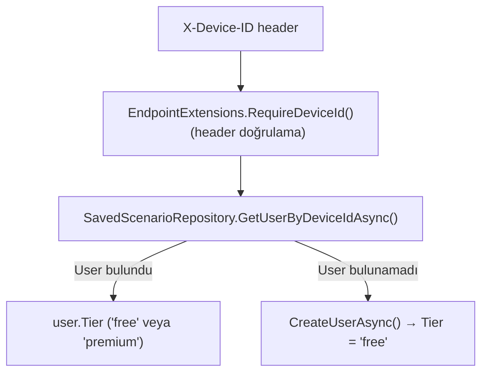
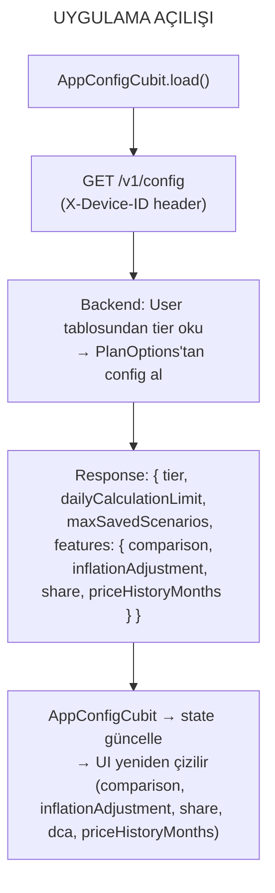
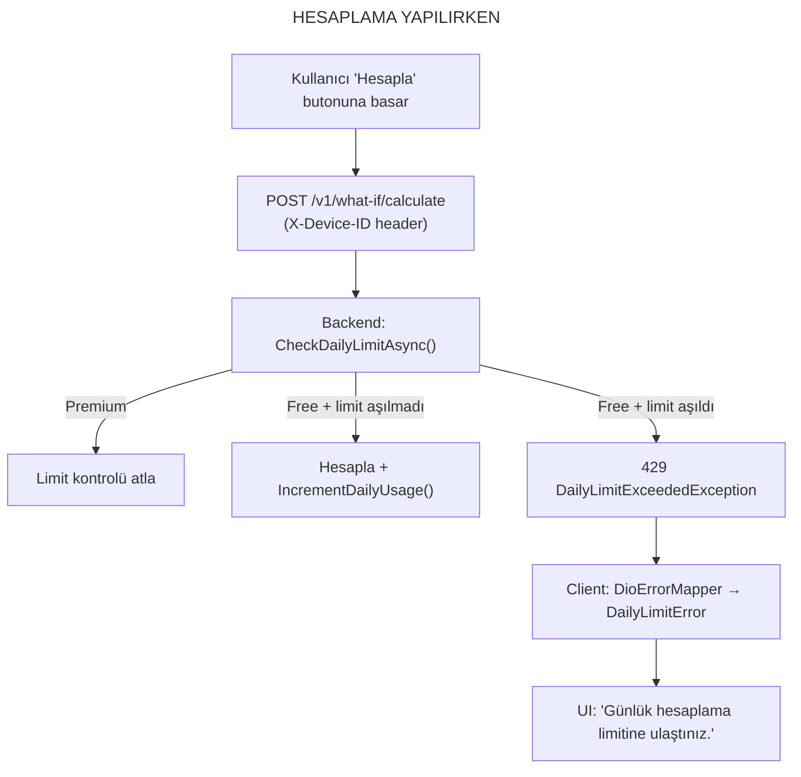
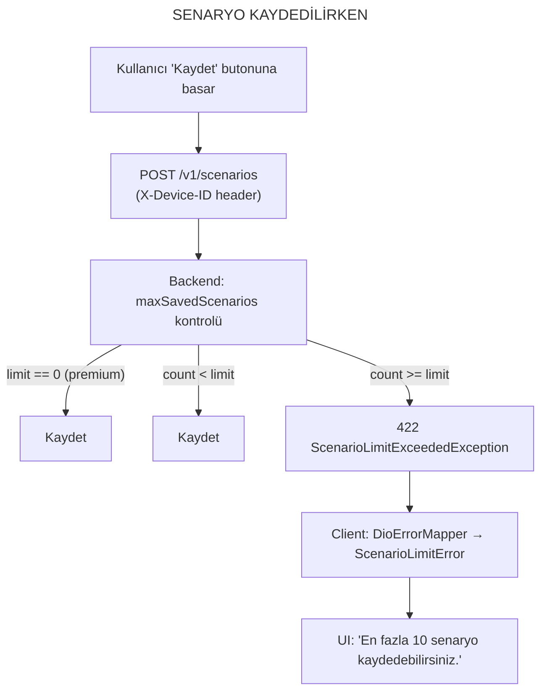

# Tier (Plan) Sistemi — Detaylı Dokümantasyon

Bu doküman, Saydın uygulamasındaki tier bazlı kontrollerin **nerede**, **nasıl** ve **hangi katmanda** uygulandığını açıklar. Hem backend (Services) hem frontend (Client) tarafını kapsar.

---

## Genel Bakış

Sistem iki tier destekler:

| Tier | Günlük Hesaplama | Senaryo Limiti | Enflasyon | Fiyat Geçmişi | Karşılaştırma | Paylaşım | DCA |
|------|-------------------|----------------|-----------|---------------|----------------|----------|-----|
| **free** | 20/gün | 10 | Kilitli | Son 12 ay | Açık | Açık | Açık |
| **premium** | Sınırsız (0) | Sınırsız (0) | Açık | Tüm geçmiş (0) | Açık | Açık | Açık |

> `0` değeri "sınırsız" anlamına gelir.

---

## 1. Konfigürasyon Tanımı (Backend)

### PlanOptions — Tier Tanımları

**Dosya:** `src/Saydin.Services/src/Saydin.Api/Options/PlanOptions.cs`

```csharp
public class PlanOptions
{
    public const string SectionName = "Plans";
    public TierOptions Free { get; init; } = new();
    public TierOptions Premium { get; init; } = new();

    public TierOptions GetTierOptions(string? tier) =>
        string.Equals(tier, "premium", StringComparison.OrdinalIgnoreCase) ? Premium : Free;
}

public class TierOptions
{
    public int DailyCalculationLimit { get; init; } = 20;  // 0 = sınırsız
    public int MaxSavedScenarios { get; init; } = 10;      // 0 = sınırsız
    public FeatureOptions Features { get; init; } = new();
}

public class FeatureOptions
{
    public bool Comparison { get; init; } = true;
    public bool InflationAdjustment { get; init; } = true;
    public bool Share { get; init; } = true;
    public bool Dca { get; init; } = true;
    public int PriceHistoryMonths { get; init; } = 12;     // 0 = tüm geçmiş
}
```

### appsettings.json — Değerler

**Dosya:** `src/Saydin.Services/src/Saydin.Api/appsettings.json` (satır 19-40)

```json
{
  "Plans": {
    "Free": {
      "DailyCalculationLimit": 20,
      "MaxSavedScenarios": 10,
      "Features": {
        "Comparison": true,
        "InflationAdjustment": true,
        "Share": true,
        "Dca": true,
        "PriceHistoryMonths": 12
      }
    },
    "Premium": {
      "DailyCalculationLimit": 0,
      "MaxSavedScenarios": 0,
      "Features": {
        "Comparison": true,
        "InflationAdjustment": true,
        "Share": true,
        "Dca": true,
        "PriceHistoryMonths": 0
      }
    }
  }
}
```

### DI Kaydı

**Dosya:** `src/Saydin.Services/src/Saydin.Api/Program.cs` (satır 162-163)

```csharp
builder.Services.Configure<PlanOptions>(
    builder.Configuration.GetSection(PlanOptions.SectionName));
```

---

## 2. Cihaz → Tier Eşleşmesi

### Akış



### User Entity

**Dosya:** `src/Saydin.Services/src/Saydin.Shared/Entities/User.cs`

```csharp
public class User
{
    public string DeviceId { get; set; }      // Primary identifier
    public string Tier { get; set; } = "free"; // "free" veya "premium"
    public string? Email { get; set; }
    public DateTimeOffset CreatedAt { get; set; }
    public DateTimeOffset LastSeenAt { get; set; }
}
```

### Device-ID Doğrulama Filtresi

**Dosya:** `src/Saydin.Services/src/Saydin.Api/Endpoints/EndpointExtensions.cs` (satır 10-38)

- Header zorunluluğu kontrol eder
- Maks 128 karakter, izin verilen: harf, rakam, `-`, `_`, `.`
- Geçersizse `400 Bad Request` döner
- Geçerliyse `HttpContext.Items["DeviceId"]` içine koyar

### Tier Ataması

- Yeni kullanıcı oluşturulurken varsayılan tier: `"free"`
- **Premium'a yükseltme için henüz API endpoint'i yok** — sadece DB üzerinden değiştirilebilir

---

## 3. Günlük Hesaplama Limiti (Server-Side)

### Kontrol Noktası

**Dosya:** `src/Saydin.Services/src/Saydin.Api/Services/WhatIfCalculator.cs`

Bu kontrol **üç endpoint** için geçerlidir:
- `POST /v1/what-if/calculate`
- `POST /v1/what-if/compare`
- `POST /v1/what-if/dca`

### CheckDailyLimitAsync() — Satır 278-297

```csharp
private async Task CheckDailyLimitAsync(User? user, CancellationToken ct)
{
    if (user?.Tier == PremiumTier) return;  // Premium → kontrol atla

    var key = BuildUsageKey(user);          // usage:whatif:{id}:{YYYY-MM-DD}
    var count = await _redis.GetAsync(key);

    if (_tierOptions.DailyCalculationLimit > 0 && count >= _tierOptions.DailyCalculationLimit)
        throw new DailyLimitExceededException();
}
```

### IncrementDailyUsageAsync() — Satır 299-320

```csharp
private async Task IncrementDailyUsageAsync(User? user, CancellationToken ct)
{
    if (user?.Tier == PremiumTier) return;  // Premium → sayma

    // Redis Lua script ile atomik artış + TTL ayarı
    // TTL: gece yarısına kalan milisaniye (UTC 00:00)
    // İlk artışta PEXPIRE set eder
}
```

### Redis Key Formatı

```
usage:whatif:{userId|deviceId}:{YYYY-MM-DD}
```

- Her gün yeni key oluşur
- TTL otomatik olarak gece yarısında sona erer
- Redis erişilemezse → log atar ama hesaplamaya devam eder (graceful degradation)

### Hata Fırlatma

**Exception:** `DailyLimitExceededException`
**Dosya:** `src/Saydin.Services/src/Saydin.Shared/Exceptions/DailyLimitExceededException.cs`

### Hata Yakalama

**Dosya:** `src/Saydin.Services/src/Saydin.Api/Exceptions/DailyLimitExceededExceptionHandler.cs`

```
HTTP 429 Too Many Requests
{
  "type": "https://saydin.app/errors/daily-limit-exceeded",
  "title": "Günlük hesaplama limitine ulaştınız.",
  "status": 429,
  "extensions": {
    "resetAt": "2026-03-19T00:00:00Z"  ← sonraki gece yarısı (UTC)
  }
}
```

---

## 4. Senaryo Kayıt Limiti (Server-Side)

### Kontrol Noktası

**Dosya:** `src/Saydin.Services/src/Saydin.Api/Services/SavedScenarioService.cs`

Bu kontrol `POST /v1/scenarios` endpoint'i için geçerlidir.

### SaveScenarioAsync() — Satır 29-74

```csharp
public async Task<SavedScenario> SaveScenarioAsync(...)
{
    var scenarioLimit = _tierOptions.MaxSavedScenarios;

    if (scenarioLimit > 0)  // 0 = sınırsız (premium)
    {
        var currentCount = await _repository.CountByUserIdAsync(userId, ct);
        if (currentCount >= scenarioLimit)
            throw new ScenarioLimitExceededException(scenarioLimit);
    }
    // ... kaydet
}
```

### Hata Yakalama

**Dosya:** `src/Saydin.Services/src/Saydin.Api/Exceptions/ScenarioLimitExceededExceptionHandler.cs`

```
HTTP 422 Unprocessable Entity
{
  "type": "https://saydin.app/errors/scenario-limit-exceeded",
  "title": "Senaryo limiti aşıldı.",
  "status": 422,
  "extensions": {
    "limit": 10
  }
}
```

---

## 5. Feature Flag'ler (Server-Side)

### Config Endpoint

**Dosya:** `src/Saydin.Services/src/Saydin.Api/Endpoints/AppConfigEndpoints.cs`

`GET /v1/config` → kullanıcının tier'ine göre konfigürasyonu döner:

```csharp
var tier = user?.Tier ?? "free";
var tierOptions = planOptions.GetTierOptions(tier);

return Results.Ok(new AppConfigResponse
{
    Tier = tier,
    DailyCalculationLimit = tierOptions.DailyCalculationLimit,
    MaxSavedScenarios = tierOptions.MaxSavedScenarios,
    Features = new AppFeatureFlags
    {
        Comparison = tierOptions.Features.Comparison,
        InflationAdjustment = tierOptions.Features.InflationAdjustment,
        Share = tierOptions.Features.Share,
        Dca = tierOptions.Features.Dca,
        PriceHistoryMonths = tierOptions.Features.PriceHistoryMonths,
    }
});
```

### Response Modeli

**Dosya:** `src/Saydin.Services/src/Saydin.Api/Models/Responses/AppConfigResponse.cs`

```csharp
public record AppConfigResponse
{
    public string Tier { get; init; }
    public int DailyCalculationLimit { get; init; }
    public int MaxSavedScenarios { get; init; }
    public AppFeatureFlags Features { get; init; }
}

public record AppFeatureFlags
{
    public bool Comparison { get; init; }
    public bool InflationAdjustment { get; init; }
    public bool Share { get; init; }
    public bool Dca { get; init; }
    public int PriceHistoryMonths { get; init; }
}
```

### Server-Side Uygulama Durumu

| Feature Flag | Server-Side Kontrol | Açıklama |
|---|---|---|
| `Comparison` | YOK | `/v1/what-if/compare` her zaman çalışır |
| `InflationAdjustment` | YOK | `includeInflation: true` her zaman kabul edilir |
| `Share` | YOK | Paylaşım tamamen client-side |
| `Dca` | YOK | DCA simülasyonu her zaman çalışır |
| `PriceHistoryMonths` | YOK | Fiyat geçmişi her zaman tam döner |
| `DailyCalculationLimit` | VAR | Redis ile kontrol edilir |
| `MaxSavedScenarios` | VAR | DB count ile kontrol edilir |

> **Not:** `Comparison`, `InflationAdjustment`, `Share` ve `PriceHistoryMonths` flag'leri backend'de sadece tanımlanır ve client'a bilgi amaçlı gönderilir. **Server-side enforcement yoktur** — client bu flag'lere güvenerek UI'da kilitler. Bu, güvenlik açısından bilinçli bir MVP kararıdır.

---

## 6. Client Tarafı — AppConfig Yapısı

### Domain Entity

**Dosya:** `src/Saydin.Client/lib/features/config/domain/entities/app_config.dart`

```dart
class AppConfig extends Equatable {
  final String tier;                  // 'free' veya 'premium'
  final int dailyCalculationLimit;    // 0 = sınırsız
  final int maxSavedScenarios;        // 0 = sınırsız
  final AppFeatureFlags features;

  bool get isPremium => tier == 'premium';
  bool get isUnlimitedCalculations => dailyCalculationLimit == 0;
  bool get isUnlimitedScenarios => maxSavedScenarios == 0;

  static const defaultConfig = AppConfig(
    tier: 'free',
    dailyCalculationLimit: 20,
    maxSavedScenarios: 10,
    features: AppFeatureFlags(
      comparison: true,
      inflationAdjustment: true,
      share: true,
      dca: true,
      priceHistoryMonths: 12,
    ),
  );
}
```

- `defaultConfig`: Backend'e ulaşılamazsa bu değerler kullanılır
- `isPremium` getter'ı UI'da feature gating için kullanılır

### Data Model

**Dosya:** `src/Saydin.Client/lib/features/config/data/models/app_config_model.dart`

Backend JSON'unu parse eder, null-safe default'larla.

### AppConfigCubit

**Dosya:** `src/Saydin.Client/lib/features/config/presentation/cubit/app_config_cubit.dart`

```dart
class AppConfigCubit extends Cubit<AppConfig> {
  AppConfigCubit(this._repository) : super(AppConfig.defaultConfig);

  Future<void> load() async {
    try {
      final config = await _repository.getConfig();
      emit(config);
    } catch (_) {
      // Hata → defaultConfig ile devam et (graceful degradation)
    }
  }
}
```

- Uygulama açılışında `load()` çağrılır (`app.dart` satır 33)
- Singleton olarak kayıtlı (`injection.dart` satır 33-36)
- Hata durumunda sessizce default config kullanır

---

## 7. Client Tarafı — Feature Gating Noktaları

### 7.1 Enflasyon Toggle (3 sayfada kullanılır)

**Widget:** `src/Saydin.Client/lib/core/widgets/inflation_toggle.dart`

```dart
// enabled=false ise switch devre dışı + "Premium" badge gösterilir
Switch(
  value: enabled ? value : false,
  onChanged: enabled ? (_) => onToggle() : null,
),
if (!enabled) ...[
  Text(l10n.premiumFeature),  // "Premium" badge
],
```

**Kullanıldığı yerler:**

| Sayfa | Dosya | Config Okuması |
|-------|-------|----------------|
| What-If | `what_if_page.dart` (satır 195-199) | `config.features.inflationAdjustment` |
| Portföy | `portfolio_page.dart` (satır 276-282) | `config.features.inflationAdjustment` |
| Karşılaştırma | `comparison_page.dart` | `config.features.inflationAdjustment` |
| DCA | `dca_page.dart` | `config.features.inflationAdjustment` |

### 7.2 Fiyat Geçmişi Tarih Kısıtlaması (3 sayfada)

**Utility:** `src/Saydin.Client/lib/core/utils/date_range_utils.dart`

```dart
// priceHistoryMonths == 0 → premium, tüm geçmiş
// priceHistoryMonths > 0  → free, son N ay
({DateTime? firstDate, DateTime? lastDate}) assetDateRange({
  required DateTime? assetFirstDate,
  required DateTime? assetLastDate,
  required int priceHistoryMonths,
}) {
  if (priceHistoryMonths == 0) {
    return (firstDate: assetFirstDate, lastDate: lastDate);
  }
  final cutoff = DateTime(lastDate.year, lastDate.month - priceHistoryMonths, lastDate.day);
  // cutoff'tan önceyi seçtirmez
}
```

**Kullanıldığı yerler:**

| Sayfa | Dosya | Etki |
|-------|-------|------|
| What-If | `what_if_page.dart` (satır 168-174) | Tarih seçicide ilk tarih kısıtlanır |
| Portföy | `portfolio_page.dart` (satır 209-216) | Tarih seçicide ilk tarih kısıtlanır |
| Karşılaştırma | `comparison_page.dart` | `comparisonDateRange()` ile kısıtlanır |
| DCA | `dca_page.dart` | Tarih seçicide ilk tarih kısıtlanır |

### 7.3 Günlük Hesaplama Limiti Hatası

**Hata akışı:**

```
Backend HTTP 429
    ↓
DioErrorMapper.map() → DailyLimitError(resetAt: ...)
    ↓
WhatIfBloc / ComparisonBloc / PortfolioBloc / DcaBloc → emit(Failure(error))
    ↓
UI → SnackBar: "Günlük hesaplama limitine ulaştınız."
```

**Dosyalar:**

| Katman | Dosya | Detay |
|--------|-------|-------|
| Error tanımı | `core/error/app_error.dart` | `DailyLimitError(resetAt)` |
| HTTP → Error | `core/error/dio_error_mapper.dart` | 429 → `DailyLimitError` |
| BLoC | `what_if_bloc.dart` | catch → emit Failure |
| UI | `what_if_page.dart` (satır 87) | `l10n.errorDailyLimit` mesajı |

### 7.4 Senaryo Kayıt Limiti Hatası

**Hata akışı:**

```
Backend HTTP 422 (scenario-limit-exceeded)
    ↓
DioErrorMapper.map() → ScenarioLimitError(limit: 10)
    ↓
ScenariosBloc → emit(Failure(error))
    ↓
UI → SnackBar: "Ücretsiz planda en fazla 10 senaryo kaydedebilirsiniz."
```

**Dosyalar:**

| Katman | Dosya | Detay |
|--------|-------|-------|
| Error tanımı | `core/error/app_error.dart` | `ScenarioLimitError(limit)` |
| HTTP → Error | `core/error/dio_error_mapper.dart` | 422 + type kontrolü → `ScenarioLimitError` |
| BLoC | `scenarios_bloc.dart` | catch → emit Failure |
| UI | Senaryolar sayfası | `l10n.errorScenarioLimit(limit)` mesajı |

---

## 8. Lokalizasyon

**Dosya:** `src/Saydin.Client/lib/l10n/app_localizations_tr.dart`

```dart
'errorDailyLimit'    → 'Günlük hesaplama limitine ulaştınız.'
'errorScenarioLimit' → 'Ücretsiz planda en fazla {limit} senaryo kaydedebilirsiniz.'
'premiumFeature'     → 'Premium'
'inflationAdjust'    → 'Enflasyona Göre Düzelt'
```

---

## 9. Uçtan Uca Akış Diyagramı







---

## 10. Eksiklikler ve Bilinçli Kararlar

### Server-Side Uygulanmayan Feature Flag'ler

Aşağıdaki flag'ler backend'de tanımlı ve client'a gönderiliyor ancak **server tarafında kontrol edilmiyor**. Client-side gating güvenilir kabul ediliyor (MVP kararı):

| Flag | Durum | Risk |
|------|-------|------|
| `Comparison` | Client-only gating | API doğrudan çağrılırsa free kullanıcı da karşılaştırma yapabilir |
| `InflationAdjustment` | Client-only gating | `includeInflation: true` gönderilirse backend hesaplar |
| `Share` | Client-only gating | Paylaşım tamamen client-side, risk yok |
| `Dca` | Client-only gating | `/v1/what-if/dca` doğrudan çağrılırsa free kullanıcı da DCA yapabilir |
| `PriceHistoryMonths` | Client-only gating | API'den tüm tarih aralığı sorgulanabilir |

### Premium'a Yükseltme

- Henüz API endpoint'i yok
- Tier sadece DB'de `Users` tablosundaki `Tier` alanı ile değiştirilebilir
- RevenueCat veya benzeri bir ödeme sistemi entegrasyonu planlanmadı

### Graceful Degradation

- Redis erişilemezse → günlük limit kontrolü atlanır, hesaplama devam eder
- Config endpoint başarısızsa → client `defaultConfig` (free tier) ile çalışır
- Uygulama hiçbir koşulda "tamamen kilitlenmez"
