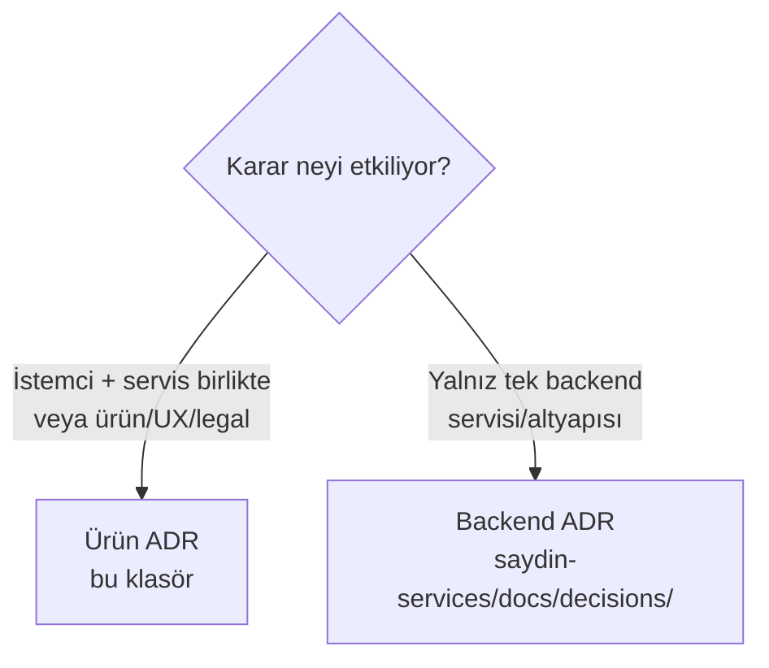

# Saydın — Ürün & Çapraz-Bileşen Mimari Karar Kayıtları (ADR)

Bu klasör **ürün/çapraz-bileşen** mimari kararlarını içerir: istemci (Flutter) + servisleri
**birlikte** etkileyen veya ürün / UX / legal nitelikli kararlar (örn. no-kafka, TimescaleDB
seçimi, device-id auth, plan-config, certificate-pinning, shared-asset module).

## İki ADR Uzayı (F4-10)

Saydın iki ayrı git reposundan oluşur ve **iki bağımsız ADR numara uzayı** vardır:

| Uzay | Konum | Kapsam | Numaralandırma |
|---|---|---|---|
| **Ürün ADR** | `Saydın` meta repo `docs/decisions/` (bu klasör) | İstemci + servis birlikte veya ürün/UX/legal | Bağımsız `ADR-001..ADR-014` |
| **Backend ADR** | `saydin-services/docs/decisions/` | Tek backend servisini/altyapısını ilgilendiren teknik kararlar | Bağımsız `ADR-001+` |

İki uzayın numaraları **kasıtlı olarak ayrıdır**; çakışma (ör. iki `ADR-005`) beklenir ve
sorun değildir — dosyalar farklı repolarda yaşar. Numaraları yeniden adlandırmak tüm
çapraz-referanslara dokunurdu (yüksek risk, MVP'de değersiz), bu yüzden yapılmaz. Atıf
konvansiyonu: **"Ürün ADR-0XX"** (bu klasör) / **"Backend ADR-00X"**
(`saydin-services/docs/decisions/`).

## Hangi ADR nereye?

## Mevcut Ürün ADR'lar

| # | Konu |
|---|---|
| ADR-001 | no-kafka-mvp |
| ADR-002 | timescaledb |
| ADR-003 | daily-granularity |
| ADR-004 | device-id-auth |
| ADR-005 | backend-monorepo |
| ADR-006 | flutter-error-handling |
| ADR-007 | embedded-price-history |
| ADR-008 | asset-date-range-in-listing |
| ADR-009 | client-side-duplicate-scenario-detection |
| ADR-010 | bloc-one-shot-flag-pattern |
| ADR-011 | centralized-plan-config |
| ADR-012 | client-settings-architecture |
| ADR-013 | certificate-pinning-strategy |
| ADR-014 | shared-asset-module |

> Backend-özgü ADR'lar (migration stratejisi, rate limiting, secrets, GeoIP, activity-log
> finansal politika vb.) için bkz. `saydin-services/docs/decisions/README.md`.
