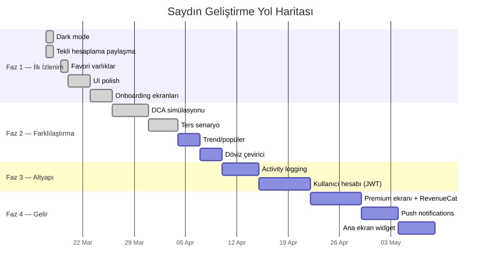
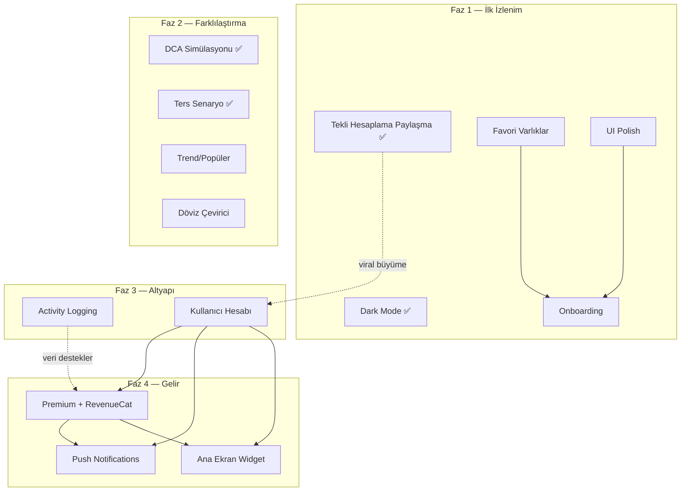

# Saydın — Ürün Yol Haritası

> Son güncelleme: 2026-03-19

## Vizyon

Saydın, "ya alsaydım?" sorusunun **en güvenilir, en kolay ve en eğlenceli** yanıtını veren uygulama olacak. Kullanıcılar uygulamayı merakla açacak, sonuçlarını paylaşacak ve düzenli olarak geri dönecek.

**Strateji:** Önce değer ver, sonra para iste. Kullanıcı "bu uygulamayı silmem" dedikten sonra premium teklif et.

---

## Mevcut Durum (v0.1 — MVP)

### Tamamlanan

| Özellik | Durum | Not |
|---------|-------|-----|
| Tekli "ya alsaydım?" hesaplama | Canlı | Endpoint + Flutter UI |
| Varlık karşılaştırma | Canlı | Backend + Flutter UI (çoklu seçim, sıralama, rozet) |
| Portföy builder (V.A — aynı tarih) | Canlı | Flutter UI + paralel hesaplama, pasta grafiği |
| Sonuç paylaşma | Canlı | Tekli hesaplama + karşılaştırma + portföy paylaşım kartları, PNG render, share sheet |
| Dark mode | Canlı | Sistem teması takibi + manuel seçim (Açık/Koyu/Sistem), SharedPreferences |
| Enflasyon düzeltmesi | Canlı | EVDS TÜFE verisi + toggle UI (tüm ekranlarda), reel getiri gösterimi |
| Senaryo kaydetme/silme | Canlı | Device-ID bazlı, tip desteği (what_if/comparison/portfolio/dca) |
| Tier sistemi (free/premium) | Yapılandırılmış | Günlük 20 hesaplama, 10 senaryo limiti |
| Redis rate limiting | Canlı | Atomik Lua script ile |
| 4 fiyat veri kaynağı | Canlı | TCMB, CoinGecko, GoldAPI, TwelveData |
| Hesaplamada fiyat geçmişi | Canlı | Yanıtta 60 noktalık grafik verisi |
| Sentry hata takibi | Canlı | Client tarafı |
| CI/CD pipeline | Canlı | GitHub Actions, Play Store upload, GitHub Release |
| Onboarding | Canlı | 6 sayfalık akış (ters senaryo sayfası dahil), animasyonlu geçişler |
| DCA (Düzenli Yatırım) simülasyonu | Canlı | Haftalık/aylık periyod, enflasyon, paylaşım, senaryo kaydetme |

### Eksikler

- Kullanıcı hesabı yok (device-ID bazlı)
- Premium satın alma akışı yok
- Activity logging yok — kullanıcı davranışını bilmiyoruz
- Push notification yok
- ~~Ters senaryo yok~~ → TAMAMLANDI (Faz 2.2)
- Döviz çevirici yok

---

## Faz Planı

### Genel Bakış



---

### Faz 1 — İlk İzlenim & Polish (v0.2)

**Hedef:** Uygulamayı indiren kişi ilk 30 saniyede "bu güzel bir uygulama" desin ve ilk hesaplamasını yapsın.

**Süre:** ~2,5 hafta

**Neden önce bu?** App Store'da kullanıcılar uygulamayı ortalama 7 gün içinde siliyorlar. İlk izlenim kötüyse mevcut güçlü özellikler bile kurtarmaz. Uygulama zaten güçlü — şimdi bunu doğru sunmak gerekiyor.

#### ~~1.1 Dark Mode~~ — TAMAMLANDI

- [x] Sistem temasını otomatik takip eder (varsayılan)
- [x] Ayarlar'dan manuel geçiş (Açık / Koyu / Sistem)
- [x] Tercih lokalde saklanır (`SharedPreferences`)
- [x] Kar rengi (yeşil) ve zarar rengi (kırmızı) her iki temada okunabilir

#### ~~1.2 Tekli Hesaplama Paylaşma~~ — TAMAMLANDI

- [x] Hesaplama sonuç ekranında "Paylaş" butonu
- [x] Paylaşım kartı: varlık, tarih, tutar, kar/zarar, reel getiri (varsa), Saydın logosu
- [x] Mevcut `ShareCardRenderer` + `SharePreviewSheet` kullanılır

#### ~~1.3 Favori Varlıklar~~ — TAMAMLANDI

- [x] Varlık listesinde yıldız ikonu ile favorileme (tüm ekranlar: hesaplama, karşılaştırma, portföy)
- [x] Favoriler listenin en üstünde (ayrı bölüm)
- [x] Lokalde saklanır (device-level, `SharedPreferences`)
- [x] Maksimum 5 favori

#### ~~1.4 UI Polish~~ — TAMAMLANDI

- [x] Hesaplama sonuç ekranında animasyonlu sayaç (profit counter)
- [x] Skeleton loading (shimmer) yerine boş ekranlar
- [x] Haptic feedback (hesaplama tamamlandığında)
- [x] App icon ve splash screen iyileştirmesi
- ~~Enflasyon düzeltmesini free tier'da açma~~ — zaten açık

#### ~~1.5 Onboarding Ekranları~~ — TAMAMLANDI

- [x] İlk açılışta gösterilir, tekrar gösterilmez (SharedPreferences flag)
- [x] 6 sayfalık akış: Hesaplama → Karşılaştırma → Portföy → Düzenli Yatırım (DCA) → Ters Senaryo → Paylaş & Kaydet
- [x] Atlama butonu var
- [x] Son sayfada "Hemen Dene" → hesaplama ekranına yönlendirme
- [x] Animasyonlu geçişler (gradient arka plan, yüzen ikonlar, fade+slide içerik)

---

### Faz 2 — Farklılaştırma (v0.3)

**Hedef:** Rakiplerden ayrıl. "Bu başka hiçbir uygulamada yok" dedirt.

**Süre:** ~2,5 hafta

**Neden ikinci?** Temel deneyim polish edildikten sonra, kullanıcıyı "vay be" dedirtecek ve geri getirecek farklılaştırıcı özellikler gerekiyor.

#### ~~2.1 Periyodik Yatırım Simülasyonu (DCA)~~ — TAMAMLANDI

| Detay | Değer |
|-------|-------|
| **Ne:** | "Her ay 1.000 TL dolar alsaydım bugün ne kadar olurdu?" |
| **Neden:** | Gerçek yatırımcı davranışını yansıtır, Türkiye'deki finans uygulamalarında yok, büyük farklılaştırıcı |
| **Bağımlılık:** | Mevcut fiyat verisi yeterli |
| **Büyüklük:** | L (büyük) — yeni endpoint + Flutter feature |

**Backend:**
- Endpoint: `POST /v1/what-if/dca`
- Request: `{ assetSymbol, startDate, endDate, periodicAmount, period, amountType, includeInflation }`
- Response: periyodik alım detayları, toplam maliyet, güncel değer, ortalama maliyet, enflasyon düzeltmesi

**Flutter:**
- Feature: `features/dca/` (Clean Architecture + BLoC)
- Tab adı: "Birikim" (TR) / "DCA" (EN)
- Sayfa başlığı: "Düzenli Yatırım Simülasyonu" (TR) / "DCA Simulation" (EN)
- Periyod seçimi (haftalık/aylık)
- Sonuç: özet tablo + paylaşım kartı
- Senaryo kaydetme (type: dca) + paylaşma desteği

**Kabul Kriterleri:**
- [x] Aylık ve haftalık periyod desteği
- [x] Birikimli değer grafiği (line chart)
- [x] Toplam yatırım vs güncel değer karşılaştırması
- [x] DCA sonucu senaryo olarak kaydedilebilir (type: dca)
- [x] Enflasyon düzeltmesi desteği
- [x] Sonuç paylaşılabilir (mevcut share altyapısı)

#### ~~2.2 Ters Senaryo (Hedef Hesaplama)~~ — TAMAMLANDI

| Detay | Değer |
|-------|-------|
| **Ne:** | "100.000 TL'ye ulaşmak için 2020'de ne kadar BTC almalıydım?" |
| **Neden:** | Hesaplamanın tersi — merak uyandırıcı, eğlenceli, paylaşılabilir |
| **Bağımlılık:** | Mevcut fiyat verisi |
| **Büyüklük:** | M |

**Backend:**
- Endpoint: `POST /v1/what-if/reverse`
- Request: `{ assetSymbol, buyDate, sellDate, targetAmount, targetAmountType, includeInflation }`
- Response: gerekli başlangıç tutarı, hedef değer, kar/zarar oranı, enflasyon düzeltmesi, fiyat geçmişi

**Flutter:**
- Hesapla sekmesinde `SegmentedButton<CalculationMode>` ile normal/ters mod geçişi
- Ters modda yalnızca TL (`try`) tutar tipi seçilebilir
- `ReverseResultCard` — gerekli yatırım, hedef değer, kar/zarar, enflasyon, grafik
- `ReverseShareCardWidget` — paylaşım kartı
- Senaryo kaydetme (`extraData.mode: 'reverse'`) + tekrar oynatma desteği
- Onboarding'e ters senaryo sayfası eklendi (sayfa 5/6)

**Kabul Kriterleri:**
- [x] Hedef tutar girişi (TL)
- [x] "Ne kadar yatırmalıydın?" sonucu
- [x] Sonuç paylaşılabilir
- [x] Senaryo kaydetme ve tekrar oynatma
- [x] Enflasyon düzeltmesi desteği
- [x] Senaryo kartında "Ters Hesaplama" rozeti

#### 2.3 Trend / Popüler Hesaplamalar

| Detay | Değer |
|-------|-------|
| **Ne:** | "Bu hafta en çok hesaplanan: Bitcoin" — topluluk verileri |
| **Neden:** | Sosyal kanıt, keşif, geri dönüş sebebi |
| **Bağımlılık:** | Yok — Redis sorted set ile basit MVP |
| **Büyüklük:** | S-M |

**MVP yaklaşımı (activity logging olmadan):**
- Her hesaplamada Redis sorted set'e `ZINCRBY popular:weekly {symbol}` ekle
- TTL: 7 gün
- Endpoint: `GET /v1/trends` → en çok hesaplanan 5 varlık

**Kabul Kriterleri:**
- [ ] Ana sayfada "Trend Varlıklar" bölümü
- [ ] Haftalık sıfırlanan popülerlik sıralaması
- [ ] Varlığa tıklayınca hesaplama ekranına yönlendirme

#### 2.4 Döviz Çevirici

| Detay | Değer |
|-------|-------|
| **Ne:** | Basit güncel kur hesaplama |
| **Neden:** | Günlük kullanım değeri yaratır — kullanıcıyı düzenli geri getirir |
| **Bağımlılık:** | Gerçek zamanlı veya gün içi fiyat verisi altyapısı (mevcut veri günlük kapanış bazlı, çevirici için yetersiz) |
| **Büyüklük:** | M |

> **Not:** Mevcut fiyat verisi günlük kapanış bazlı (TCMB gösterge kuru, CoinGecko EOD). Kullanıcı "döviz çevirici"den anlık kur bekler. Bu özellik, gün içi fiyat verisi altyapısı kurulana veya "gösterge niteliğinde" etiketiyle sunulmasına karar verilene kadar ertelendi.

**Kabul Kriterleri:**
- [ ] "TL → Dolar/Euro/Altın" ve tersi çeviri
- [ ] Güncel fiyat verisini kullanır
- [ ] Ana sayfadan erişilebilir (tab veya menü)
- [ ] Sonucu kopyalama butonu
- [ ] "Son güncelleme" zaman damgası gösterilir

---

### Faz 3 — Altyapı & Tanıma (v0.4)

**Hedef:** Kullanıcıyı tanı, veriye dayalı kararlar al, hesap sistemiyle kalıcılık sağla.

**Süre:** ~3 hafta

**Neden üçüncü?** Faz 1-2'deki özellikler device-ID ile çalışır. Kullanıcı hesabı, kullanıcının **saklamak isteyeceği verisi olduktan sonra** teklif edilmelidir. "Hesabın yok, senaryoların kaybolabilir — kayıt ol" doğal bir dönüşüm noktasıdır.

#### 3.1 Activity Logging

| Detay | Değer |
|-------|-------|
| **Ne:** | Kullanıcı davranışlarının asenkron olarak DB'ye kaydedilmesi |
| **Neden:** | Ürün kararlarını veriyle almak, funnel analizi, cohort raporları |
| **Bağımlılık:** | Yok (device-ID bazlı kullanıcılarla da çalışır) |
| **Büyüklük:** | L |
| **Tasarım:** | [docs/architecture/activity-logging.md](architecture/activity-logging.md) |

> Activity logging kullanıcı hesabından **önce** yapılır çünkü Faz 1-2 boyunca biriken veri, Faz 4'teki gelir kararlarını destekler.

**Kabul Kriterleri:**
- [ ] Channel pattern ile non-blocking yazım
- [ ] 11 action türü loglanır (what_if_calculate/compare/dca/reverse, scenario_save/delete/list, assets_list, asset_price, asset_price_range, config_fetch)
- [ ] Client header'ları gönderir (OS, version)
- [ ] IP maskeleme (KVKK)
- [ ] Temel materialized view'lar (DAU, popüler varlıklar)

#### 3.2 Kullanıcı Hesabı (Email + JWT)

| Detay | Değer |
|-------|-------|
| **Ne:** | Email ile kayıt/giriş, JWT token, cihazlar arası senkronizasyon |
| **Neden:** | Senaryo yedekleme, cihaz değişiminde veri kaybını önleme, premium altyapısı |
| **Bağımlılık:** | Yok (ama Faz 1-2 özellikleri kullanıcıya "kaydedecek bir şey" verir) |
| **Büyüklük:** | XL (çok büyük) |

**Önemli Tasarım Kararları:**
- Kayıt **zorunlu değil** — uygulama device-ID ile çalışmaya devam eder
- "Hesap oluştur" önerisi stratejik noktalarda gösterilir:
  - 3. senaryo kaydedildiğinde: "Senaryolarını yedeklemek ister misin?"
  - 7 gün sonra: "Cihaz değişirse verilerini kaybedebilirsin"
- Mevcut device-ID kullanıcısının verileri hesaba bağlanır (migration)
- `X-Device-ID` header kaldırılmaz — JWT yoksa device-ID fallback

**Kabul Kriterleri:**
- [ ] Email + şifre ile kayıt
- [ ] JWT access token + refresh token
- [ ] Device-ID → hesap migration (mevcut senaryolar korunur)
- [ ] "Giriş yap" ekranı (login)
- [ ] "Şifremi unuttum" akışı
- [ ] Hesap olmadan uygulama tam çalışır (zorunlu değil)

---

### Faz 4 — Gelir & Büyüme (v0.5)

**Hedef:** Sürdürülebilir gelir modeli oluştur. Kullanıcı zaten uygulamayı seviyor — premium doğal hissedecek.

**Süre:** ~4 hafta

**Neden dördüncü?** Kullanıcı uygulamayı kullanmıyorsa premium'un anlamı yok. Faz 1-3 kullanıcı tabanı ve alışkanlık oluşturur.

**Monetizasyon Felsefesi:**
- Free tier **cömert** olmalı — kullanıcı asla "bu uygulama beni sınırlıyor" hissetmemeli
- Premium = "daha fazlasını istiyorum" hissi, "temel özellikler kilitli" değil
- İlk 30 günde premium teklif gösterme (grace period)

#### 4.1 Free vs Premium Sınır Tanımı

| Özellik | Free | Premium |
|---------|------|---------|
| Tekli hesaplama | Günde 20 | Sınırsız |
| Karşılaştırma | Günde 5 | Sınırsız |
| DCA simülasyonu | Günde 3 | Sınırsız |
| Ters senaryo | Günde 3 | Sınırsız |
| Enflasyon düzeltmesi | Var | Var |
| Senaryo kaydetme | 10 adet | Sınırsız |
| Döviz çevirici | Var | Var |
| Paylaşma | Var (logolu) | Var (logosuz + özel şablon) |
| Portföy builder | 2 portföy | Sınırsız |
| Push bildirimler | Yok | Var |
| Ana ekran widget | Yok | Var |
| Reklamsız | Reklamlı | Reklamsız |
| Fiyat geçmişi | Son 12 ay | Tüm veri |

> **Kritik:** Temel hesaplama + enflasyon + paylaşma free'de açık kalır. Sınır, **miktar** üzerinden konur — özellik üzerinden değil.

#### 4.2 Premium Abonelik Ekranı + RevenueCat

| Detay | Değer |
|-------|-------|
| **Ne:** | In-app purchase entegrasyonu |
| **Neden:** | Gelir |
| **Bağımlılık:** | Kullanıcı hesabı (Faz 3.2) |
| **Büyüklük:** | L |

**Fiyatlandırma:**
- Aylık: 49 TL
- Yıllık: 399 TL (%32 tasarruf)
- 7 gün ücretsiz deneme (yıllık planda)

**Kabul Kriterleri:**
- [ ] RevenueCat SDK entegrasyonu (iOS + Android)
- [ ] Paywall ekranı (özellik karşılaştırma tablosuyla)
- [ ] Satın alma sonrası tier güncelleme (server-side webhook)
- [ ] Abonelik yönetimi ekranı (iptal linki)
- [ ] Restore purchases desteği
- [ ] Limit aşıldığında soft paywall ("Premium'a geç, sınırsız hesapla")

#### 4.3 Push Notifications (Premium)

| Detay | Değer |
|-------|-------|
| **Ne:** | Kaydedilmiş senaryolar için günlük/haftalık kar-zarar özeti |
| **Neden:** | Geri dönüş sebebi, premium değer |
| **Bağımlılık:** | Kullanıcı hesabı + FCM/APNs kurulumu |
| **Büyüklük:** | L |

**Bildirim Türleri:**
1. Günlük senaryo özeti: "Dolar senaryondaki kazanç bugün %2.3 arttı → toplam %370"
2. Haftalık portföy raporu: "Bu hafta portföyün %5.1 değer kazandı"
3. Önemli hareket: "BTC son 24 saatte %10 arttı — senaryona etkisi: +₺15.000"

**Kabul Kriterleri:**
- [ ] Firebase Cloud Messaging (FCM) entegrasyonu
- [ ] Backend: bildirim servisi (background worker)
- [ ] Bildirim tercihleri ekranı (hangi senaryolar, hangi sıklık)
- [ ] Sessiz saatler (22:00-08:00 arası bildirim yok)

#### 4.4 Ana Ekran Widget (Premium)

| Detay | Değer |
|-------|-------|
| **Ne:** | Favori senaryonun güncel durumunu ana ekranda gösterme |
| **Neden:** | Uygulamayı açmadan değer, sürekli görünürlük |
| **Bağımlılık:** | Kullanıcı hesabı, en az 1 kaydedilmiş senaryo |
| **Büyüklük:** | M |

**Kabul Kriterleri:**
- [ ] iOS WidgetKit + Android App Widget
- [ ] Seçili senaryonun güncel kar/zarar'ı
- [ ] Günlük değişim yüzdesi
- [ ] Widget'a tıklayınca ilgili senaryoya git
- [ ] 4 saatte bir otomatik güncelleme

---

### Faz 5 — Ölçeklendirme & Genişleme (v1.0+)

**Tetikleyici:** Bu faz takvime bağlı değil, **metriklere** bağlıdır.

| Özellik | Tetikleyici Metrik | Gerekçe |
|---------|-------------------|---------|
| Portföy per-asset tarihler (V.B) | Premium kullanıcı > 500 | Niş güçlü kullanıcı özelliği |
| Gün içi fiyat verisi | Premium kullanıcı > 1.000 | Maliyet yüksek, talep doğrulanmalı |
| Fiyat alarm servisi | DAU > 2.000 | Push altyapısı hazır olmalı |
| B2B API erişim katmanı | Dışarıdan talep geldiğinde | Proaktif yapılmaz |
| Kafka + event streaming | DAU > 10.000 | Tek DB darboğaz olduktan sonra |
| Kubernetes geçişi | VPS CPU > %70 sürekli | Hetzner VPS yetmediğinde |
| Read replica | DB sorgu süresi P99 > 500ms | Yük dağıtma ihtiyacı |

---

## Bağımlılık Haritası



**Bağımlılık kuralları:**
- Ok (→) = kesin bağımlılık, önce tamamlanmalı
- Kesikli ok (-.->) = yumuşak bağımlılık, paralel yapılabilir
- Aynı faz içindeki özellikler paralel geliştirilebilir

---

## Karar İlkeleri

### 1. Özellik Ekleme Kararı

Yeni bir özellik eklemeden önce şu soruları sor:

| Soru | Kötü Cevap | İyi Cevap |
|------|-----------|-----------|
| Kullanıcı bunu istiyor mu? | "Olsa güzel olur" | "3 kullanıcı bağımsız olarak istedi" |
| Bu olmadan uygulama kullanılır mı? | "Hayır, temel özellik" | "Evet ama bu onu daha iyi yapar" |
| MVP'si ne kadar sürer? | "3+ hafta" | "3-5 gün" |
| Veriye dayalı mı? | "Tahmin ediyorum" | "Activity log'da X action Y kez yapılmış" |

### 2. Free vs Premium Sınır Kararı

```
Özelliği free'ye koy EĞER:
  - Uygulamanın temel değer önerisinin parçasıysa
  - Paylaşılabilirlik / viral potansiyeli varsa
  - Rakiplerde ücretsiz sunuluyorsa

Özelliği premium'a koy EĞER:
  - "Power user" özelliğiyse (DCA sınırsız, bildirim)
  - Sunucu maliyeti yüksekse (push, widget güncelleme)
  - Kullanıcı zaten uygulamayı sevdikten sonra değer katıyorsa
```

### 3. Monetizasyon Zamanlama Kuralı

```
Premium paywall GÖSTERİLMEZ:
  - İlk 3 gün boyunca (grace period)
  - Kullanıcı ilk hesaplamasını yapmadıysa
  - Hiç senaryo kaydetmediyse

Premium paywall GÖSTERİLİR:
  - Günlük limit aşıldığında (soft paywall — "bugünlük limitin doldu")
  - 10. senaryo kaydedilmeye çalışıldığında
  - Portföy builder'da 3. portföy oluşturulurken
  - Bildirim özelliği tıklandığında
```

---

## Başarı Metrikleri

Her fazın sonunda değerlendirilecek KPI'lar:

### Faz 1 Sonrası

| Metrik | Hedef | Nasıl Ölçülür |
|--------|-------|---------------|
| D1 retention | > %30 | Activity log (Faz 3'te geriye dönük) |
| Onboarding tamamlama oranı | > %80 | Client-side event |
| İlk hesaplamayı yapma oranı | > %60 | Activity log |
| Paylaşım oranı (hesaplama başına) | > %5 | Activity log |

### Faz 2 Sonrası

| Metrik | Hedef | Nasıl Ölçülür |
|--------|-------|---------------|
| D7 retention | > %15 | Activity log |
| DCA kullanım oranı | > %20 | Activity log |
| Haftalık aktif kullanıcı (WAU) | > 200 | Activity log |
| Trend bölümü tıklama oranı | > %30 | Activity log |

### Faz 3 Sonrası

| Metrik | Hedef | Nasıl Ölçülür |
|--------|-------|---------------|
| Hesap oluşturma oranı | > %15 | DB |
| D30 retention | > %8 | Activity log |
| Senaryo/kullanıcı ortalaması | > 3 | DB |

### Faz 4 Sonrası

| Metrik | Hedef | Nasıl Ölçülür |
|--------|-------|---------------|
| Free → Premium dönüşüm | > %3 | RevenueCat |
| Premium churn (aylık) | < %10 | RevenueCat |
| MRR (aylık tekrarlayan gelir) | > 5.000 TL | RevenueCat |
| App Store puanı | > 4.5 | App Store Connect |

---

## Risk ve Azaltma

| Risk | Etki | Olasılık | Azaltma |
|------|------|----------|---------|
| Kullanıcı hesabı karmaşıklığı Faz 3'ü geciktirir | Yüksek | Orta | Firebase Auth gibi hazır çözüm kullan, custom JWT sonra ekle |
| DCA simülasyonu çok fazla DB sorgusu üretir | Orta | Düşük | Redis cache, aylık bazda chunk'la |
| App Store review'da reddedilme (IAP) | Yüksek | Düşük | RevenueCat compliance'ı takip et |
| Enflasyon verisi EVDS API'den kesilebilir | Orta | Düşük | TÜİK web scraping fallback |
| Paylaşılan kartlar uygulama indirmesine dönmez | Orta | Orta | Karta deep link / QR kod ekle |
| Premium'a çok erken geçiş kullanıcıyı kaçırır | Yüksek | Orta | 30 gün grace period, cömert free tier |

---

## Takvim Özeti

| Faz | Başlangıç | Bitiş (tahmini) | Çıktı |
|-----|-----------|-----------------|-------|
| **Faz 1** — İlk İzlenim | Hafta 1 | Hafta 2,5 | v0.2 — Polish + onboarding + yeni utility |
| **Faz 2** — Farklılaştırma | Hafta 3 | Hafta 5 | v0.3 — DCA + ters senaryo + trendler |
| **Faz 3** — Altyapı | Hafta 6 | Hafta 8 | v0.4 — Veri toplama + hesap sistemi |
| **Faz 4** — Gelir | Hafta 9 | Hafta 12 | v0.5 — İlk gelir |
| **Faz 5** — Ölçek | Metrik bazlı | — | v1.0+ — Büyüme |

> **Not:** Haftalar tahminidir. Her faz sonunda bir "değerlendirme noktası" vardır — metrikler kötüyse plandan sapılır, iyi giden şeylere daha fazla yatırım yapılır.
